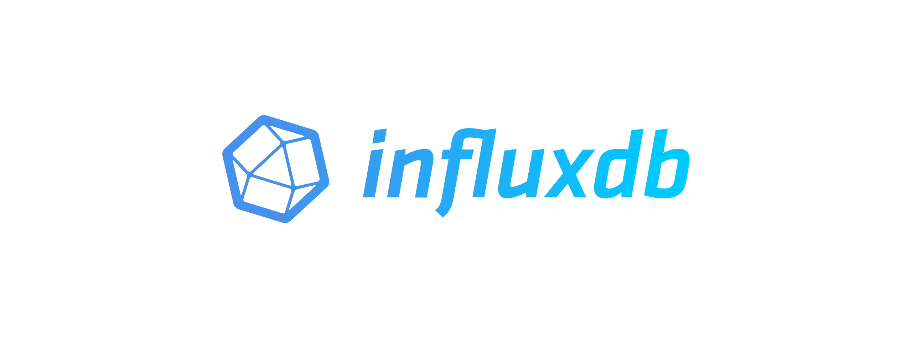

<h1>Hi there 👋 i am zhitoo </h1>

  

  
  

  <h3>Languages and tools: </h3>
  

    &nbsp;
      &nbsp;

 

      
  &nbsp;
  &nbsp;
  &nbsp;
  &nbsp;
  &nbsp;
  &nbsp;
  &nbsp;
  &nbsp;
  

 

&nbsp;&nbsp;&nbsp;&nbsp;
  

 

  &nbsp;
  &nbsp;
  &nbsp;
     

<!--
**zhitoo/zhitoo** is a ✨ _special_ ✨ repository because its `README.md` (this file) appears on your GitHub profile.

Here are some ideas to get you started:

- 🔭 I’m currently working on ...
- 🌱 I’m currently learning ...
- 👯 I’m looking to collaborate on ...
- 🤔 I’m looking for help with ...
- 💬 Ask me about ...
- 📫 How to reach me: ...
- 😄 Pronouns: ...
- ⚡ Fun fact: ...
-->
